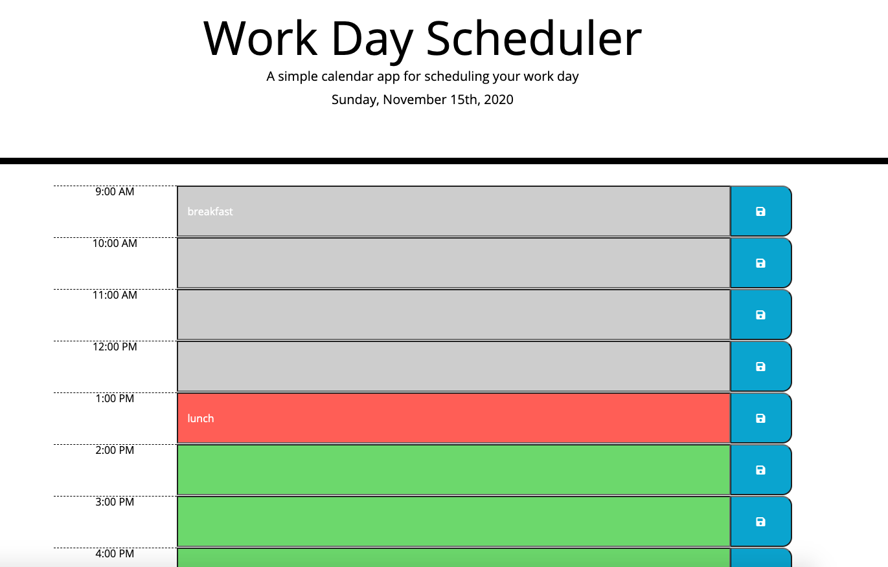
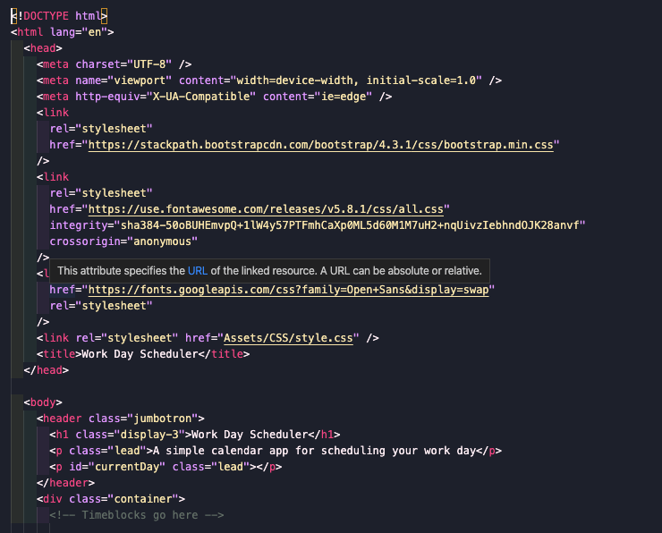
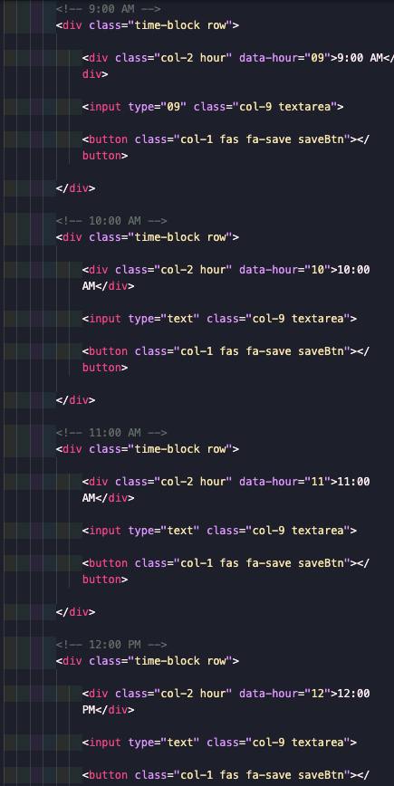
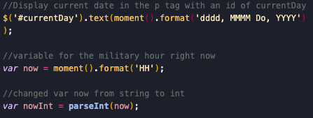
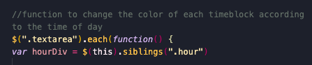
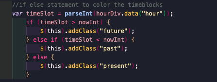
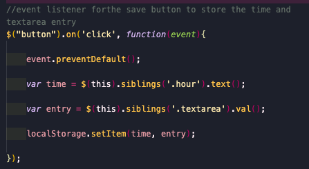
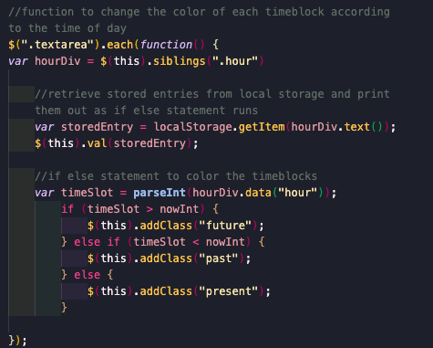

# Day Planner 

[View App](https://ashvinit.github.io/dayPlanner/)

## Description

A simple calendar application that allows a user to save events for each hour of the work day. This app runs in the broswer and feature dynamically updated HTML and CSS powered by jQuery.

1. Created index.html referencing the provided css file

2. Created time blocks for each hour in index.html with text area and button

3. Used moment.js to retrieve the hour in military time  and changed it to an int to easily compare it with the present time

4. Created function with if else statement to go through each time slot and compare the times and change the color of the timeblock

5. Function to store text entry and time

6. Retrieve stored items was added to the function to change colors of the time blocks

## Questions

If you have any further questions regarding this project, please feel free to contact.

GitHub Username: ashvinit
Email Address: ashvinithomas@gmail.com

